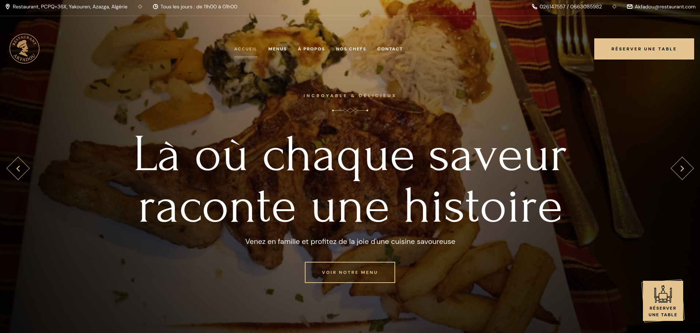
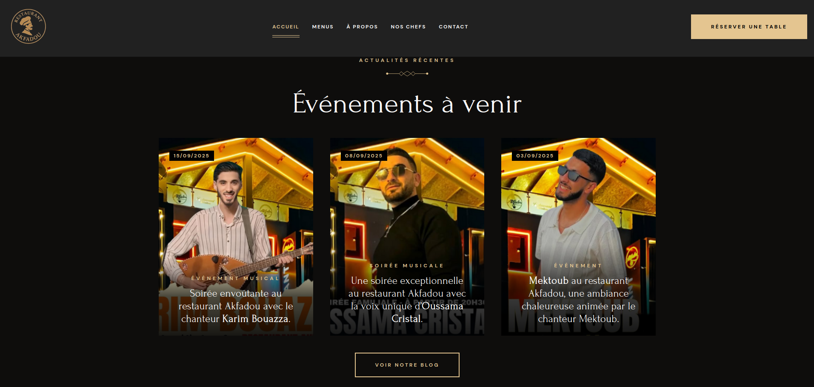
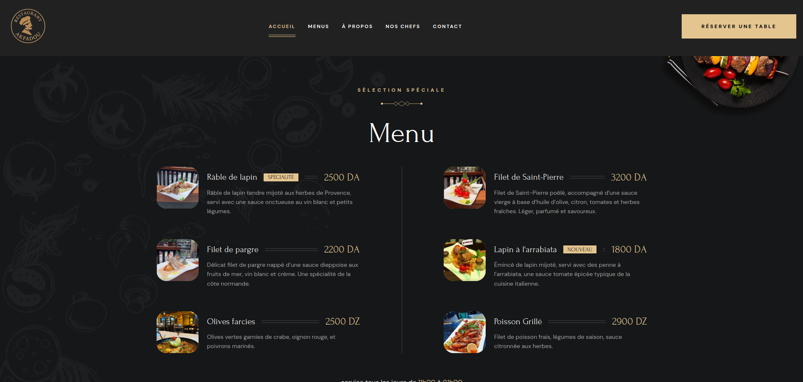

# 🍽️ Restaurant Akfadou — Site Web Officiel

Bienvenue sur le dépôt du site web du **Restaurant Akfadou**, un lieu chaleureux où gastronomie algérienne et ambiance musicale se rencontrent.

---

 Démo en ligne

 [Voir la démo](https://restaurant-akfadou.vercel.app/)  

---

 Aperçu

 Page d’accueil


 Section Événements


 Menu du restaurant



---

 Technologies utilisées

- HTML5 & CSS3
- JavaScript (Vanilla)
- [Ionicons](https://ionic.io/ionicons) pour les icônes
- Responsive Web Design
- Animations CSS (hover, transitions)
- Hébergement via Netlify, Vercel ou GitHub Pages

---

 Arborescence du projet

```bash
restaurant-akfadou/
├── assets/
│   ├── images/
│   └── fonts/
├── css/
│   └── style.css
├── js/
│   └── script.js
├── screenshots/
│   ├── homepage.png
│   ├── events.png
│   └── menu.png
├── index.html
├── README.md
└── ...

Installation locale

```bash
git clone https://github.com/Nacer-lrb/Restaurant.Akfadou
cd restaurant-akfadou